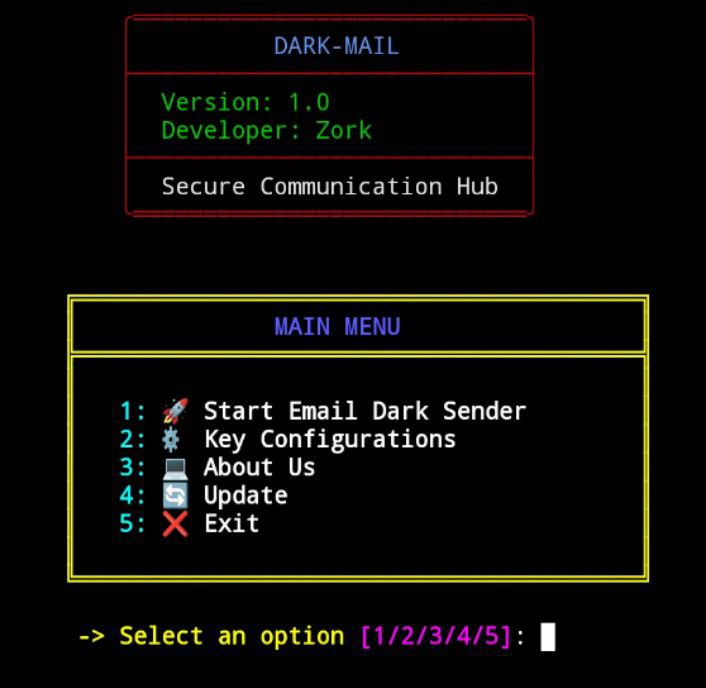

<h1 align="center">DarkMail v1.0<br></h1>

* `📧 🔒`<br />
* `An advanced and secure email automation tool for Python users`

---

## Disclaimer
*This tool is for educational purposes only!*  
_Do not use DarkMail for unethical or illegal activities._  
*I will not be responsible for any misuse.*

---

## About
* `End-to-End secure email handling and automation.`
* `Supports bulk emailing with custom templates.`
* `Cross-platform: Works on Linux, Windows, and Mac.`
* `No coding knowledge required for basic usage.`
* `Integrates easily with third-party APIs.`
* `Supports personalized HTML email content.`

---

## Features
* `Secure and reliable email sending with built-in error handling.`
* `Supports modern email APIs like SMTP, SendGrid, and more.`
* `Customizable templates for HTML and plain-text emails.`
* `Automation-friendly with easy scheduling options.`
* `Detailed delivery reports with API integration.`

---

## Requirements
<ul>
  <li>Python 3.7 or higher</li>
  <li>pip (Python package manager)</li>
  <li>Internet connection</li>
</ul>

---

## Usage

#### Installation
Update your system packages:
```bash
pkg update && pkg upgrade
```
Install dependencies:
```bash
pkg install git python
```
Clone the repository:
```bash
git clone https://github.com/samay825/Dark-Email.git
```
Go to the DarkMail directory:
```bash
cd Dark-Email
```
Install Python requirements:
```bash
pip install -r requirements.txt
```
Run the script:
```bash
python3 main.py
```

---

## Tested On:
<ul>
  <li>Termux</li>
  <li>Kali-Linux</li>
</ul>

---

## Version
* `v1.0 DarkMail`

---


## Note
* `DarkMail is a tool to help streamline email workflows.`  
* `Ensure compliance with legal and ethical standards.`

---

## Contact Us
* `If you have any feedback or queries:`  
* `Instagram: @sincryptzork`  
* `Telegram: @sincryptzork`

---

## Telegram Channel

* `Stay updated with the latest news and features of DarkMail!`  
* `Link: https://t.me/TeamSincryption`

---

## License
Apache 2.0 © Zork
